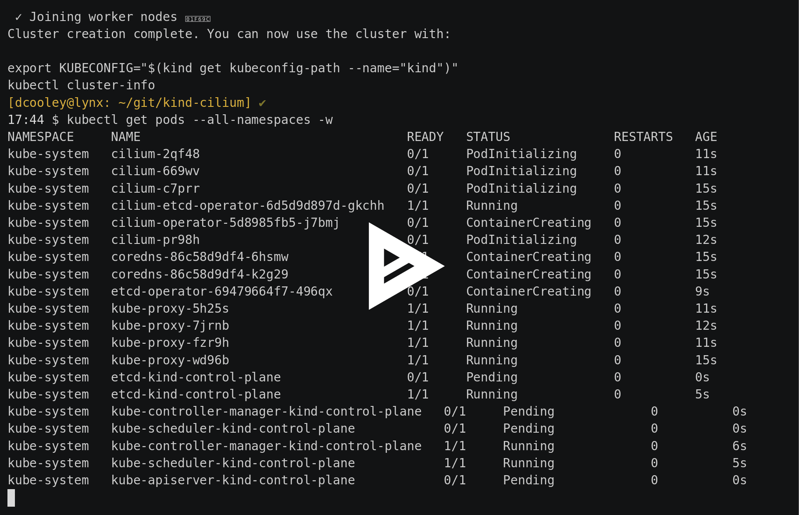

### Howto use cilium and hostport.

#### Problem Statement:

When creating a pod with hostport defined like this

``` yaml
apiVersion: extensions/v1beta1
kind: Deployment
metadata:
  labels:
    run: echo
  name: echo
spec:
  selector:
    matchLabels:
      run: echo
  template:
    metadata:
      labels:
        run: echo
    spec:
      containers:
      - image: inanimate/echo-server
        imagePullPolicy: Always
        name: echo
        ports:
        - containerPort: 8080
          hostPort: 80
          protocol: TCP
```

I expect that I can curl for the echo-server against the hostIP of any node that a pod from this deployment lands on.

This is because of the way that hostPort works. In most cni implementations hostPort is managed by chaining the portmap plugin provided as part of the installation of the cni package.

You can read more about the cni package [here](https://github.com/containernetworking/cni)

Typically, you would install the cni package at the same time you install the other prerequisite packages for Kubernetes to run.

You can read more about that [here](https://kubernetes.io/docs/setup/independent/install-kubeadm/)

When installing kubelet the cni package will be pulled in as a dependency.

With cilium <= 1.5 there isn't an easy way enable the portmap plugin. Post 1.5 this [issue](https://github.com/cilium/cilium/pull/7839) will be merged and we can use that mechanism to manage the chaining.
In the meantime I am going to walk through how to enable hostPort and cilium for a kind cluster.

#### Assumptions:
You will be using kind and by default kind will install the cni package in the node image. You can verify this by checking the content of the /opt/cni/bin directory.
The content should look like this:
```bash
16:49 $ ls -al /opt/cni/bin/
total 49016
drwxr-xr-x 2 root root     4096 Mar 26 16:05 .
drwxr-xr-x 3 root root     4096 Apr 30  2018 ..
-rwxr-xr-x 1 root root  4028260 Mar 15 10:25 bridge
-rwxr-xr-x 1 root root 10232415 Mar 15 10:26 dhcp
-rwxr-xr-x 1 root root  2856252 Mar 15 10:25 flannel
-rwxr-xr-x 1 root root  3127363 Mar 15 10:25 host-device
-rwxr-xr-x 1 root root  3036768 Mar 15 10:26 host-local
-rwxr-xr-x 1 root root  3572685 Mar 15 10:26 ipvlan
-rwxr-xr-x 1 root root  3084347 Mar 15 10:26 loopback
-rwxr-xr-x 1 root root  3613497 Mar 15 10:26 macvlan
-rwxr-xr-x 1 root root  3551125 Mar 15 10:25 portmap
-rwxr-xr-x 1 root root  3993428 Mar 15 10:26 ptp
-rwxr-xr-x 1 root root  2641877 Mar 15 10:26 sample
-rwxr-xr-x 1 root root  2850029 Mar 15 10:25 tuning
-rwxr-xr-x 1 root root  3568537 Mar 15 10:26 vlan

```

if you are running a debian based system you can check for the version of cni running with:
```bash
16:49 $ dpkg -l kubernetes-cni
Desired=Unknown/Install/Remove/Purge/Hold
| Status=Not/Inst/Conf-files/Unpacked/halF-conf/Half-inst/trig-aWait/Trig-pend
|/ Err?=(none)/Reinst-required (Status,Err: uppercase=bad)
||/ Name                                      Version                   Architecture              Description
+++-=========================================-=========================-=========================-========================================================================================
ii  kubernetes-cni                            0.7.5-00                  amd64                     Kubernetes CNI

```

If `/opt/cni/bin` looks okay we can proceed.

#### Let's talk about the kind config.

Our config for this cluster will bring up 1 master and 3 workers.

Since kind needs to have a fully qualified path for the extraMounts stuff.

Let's symlink [kind/cni](./kind/cni) to [/tmp/cni]
While we are at it let's create an empty directory at `/tmp/empty` as well.

From the directory where you have this repository checked out run:
``` bash
ln -sfn $(pwd)/kind/cni /tmp/cni
mkdir /tmp/empty

```

Now that is setup let's look at our [./kind/config](./kind/config)

```yaml
kind: Cluster
apiVersion: kind.sigs.k8s.io/v1alpha3
nodes:
- role: control-plane
  extraMounts:
  - containerPath: /kind/manifests/default-cni.yaml
    hostPath: /tmp/cni/cilium.yaml
    readOnly: true
    type: File
  - containerPath: /etc/cni/net.d/000-cilium-portmap.conflist
    hostPath: /tmp/cni/000-cilium-portmap.conflist
    readOnly: true
    type: File
- role: worker
  extraMounts:
  - containerPath: /etc/cni/net.d/000-cilium-portmap.conflist
    hostPath: /tmp/cni/000-cilium-portmap.conflist
    readOnly: true
    type: File
- role: worker
  extraMounts:
  - containerPath: /opt/cni/
    hostPath: /tmp/empty
    readOnly: false
    type: Directory
  - containerPath: /etc/cni/net.d/000-cilium-portmap.conflist
    hostPath: /tmp/cni/000-cilium-portmap.conflist
    readOnly: true
    type: File
- role: worker
kubeadmConfigPatches:
- |
  apiVersion: kubeadm.k8s.io/v1beta1
  kind: ClusterConfiguration
  metadata:
    name: config
  networking:
    serviceSubnet: "10.96.0.1/12"
    podSubnet: "192.168.0.0/16"
```

in this config we are mounting in as an extra file this file:
`000-cilium-portmap.conflist`
```
{
    "name": "cilium-portmap",
    "plugins": [
        {
            "type": "cilium-cni"
        },
        {
            "type": "portmap",
            "capabilities": {
                "portMappings": true
            }
        }
    ]
}
```
This file is responsible for chaining the cilium-cni and the portmap plugin so that portmap can handle the hostPort configuration.

In our example we have 3 workers.
The first worker is completely configured and we expect that once the cluster is up and operational we will be able to curl https://kind-worker/ and see the echo-server.
The second worker we have overwritten /opt/cni/bin with an empty directory so that we can simulate a node that did not have the cni package installed.
The third worker we assume cni is installed but that the `000-cilium-portmap.conflist` file is not installed.

In theory only the first worker should allow curl to work. The other two will require some post install configuration to work correctly.

Let's get that cluster stood up and see what we see.

Click the image below to watch the asciicast of bringup
[](./content/bringup.svg)

At this point the cluster is up and stable.

Now let's deploy some simple apps and test our theories.

```bash
18:02 $ kubectl apply -f manifests/static/
pod/echo-kind-worker created
pod/echo-kind-worker2 created
pod/echo-kind-worker3 created
18:04 $ kubectl get pods
NAME                READY   STATUS    RESTARTS   AGE
echo-kind-worker    1/1     Running   0          29s
echo-kind-worker2   1/1     Running   0          29s
echo-kind-worker3   1/1     Running   0          29s

```

Let's look at those manifests. They are all basically statically defined pods that assume that the worker nodes are names according to the defaults that kind uses.

```yaml
apiVersion: v1
kind: Pod
metadata:
  name: echo-kind-worker
  labels:
    run: echo
spec:
  containers:
  - image: inanimate/echo-server
    name: echo
    ports:
    - containerPort: 8080
      hostPort: 80
      protocol: TCP
  nodeName: kind-worker

```

Sidenote: the interesting thing about this manifest is that it bypasses the controller manager and scheduler. We have defined a pod via the apiserver that already has all it needs to be operated on by the kubelet.

Ok now that the pods are running let's see what we see.

Our expectation is that we can our echo-server on the node ip kind-worker on port 80. This is because we have configured the pod spec with hostPort: 80.

```bash
kubectl get pods -o custom-columns=name:.metadata.name,nodeIP:.status.hostIP
name                nodeIP
echo-kind-worker    172.17.0.4
echo-kind-worker2   172.17.0.5
echo-kind-worker3   172.17.0.2
```

Based on the output above we should be able to `curl http://172.17.0.4`

```bash
curl 172.17.0.4
Welcome to echo-server!  Here's what I know.
  > Head to /ws for interactive websocket echo!

-> My hostname is: echo-kind-worker

-> Requesting IP: 172.17.0.1:51598

-> Request Headers | 

  HTTP/1.1 GET /

  Host: 172.17.0.4
  Accept: */*
  User-Agent: curl/7.58.0


-> Response Headers | 

  Content-Type: text/plain
  X-Real-Server: echo-server

  > Note that you may also see "Transfer-Encoding" and "Date"!


-> My environment |
  ADD_HEADERS={"X-Real-Server": "echo-server"}
  HOME=/
  HOSTNAME=echo-kind-worker
  KUBERNETES_PORT=tcp://10.96.0.1:443
  KUBERNETES_PORT_443_TCP=tcp://10.96.0.1:443
  KUBERNETES_PORT_443_TCP_ADDR=10.96.0.1
  KUBERNETES_PORT_443_TCP_PORT=443
  KUBERNETES_PORT_443_TCP_PROTO=tcp
  KUBERNETES_SERVICE_HOST=10.96.0.1
  KUBERNETES_SERVICE_PORT=443
  KUBERNETES_SERVICE_PORT_HTTPS=443
  PATH=/usr/local/sbin:/usr/local/bin:/usr/sbin:/usr/bin:/sbin:/bin
  PORT=8080
  SSLPORT=8443


-> Contents of /etc/resolv.conf | 
nameserver 10.96.0.10
search default.svc.cluster.local svc.cluster.local cluster.local
options ndots:5


-> Contents of /etc/hosts | 
# Kubernetes-managed hosts file.
127.0.0.1	localhost
::1	localhost ip6-localhost ip6-loopback
fe00::0	ip6-localnet
fe00::0	ip6-mcastprefix
fe00::1	ip6-allnodes
fe00::2	ip6-allrouters
192.168.2.232	echo-kind-worker


-> And that's the way it is 2019-05-01 01:11:09.285173237 +0000 UTC

// Thanks for using echo-server, a project by Mario Loria (InAnimaTe).
// https://github.com/inanimate/echo-server
// https://hub.docker.com/r/inanimate/echo-server

```

it works!

If we exec into that node we can see the iptables rules associated with hostPort have been created by the portmap plugin.

```bash
18:12 $ docker exec kind-worker iptables-save | grep HOSTPORT
:CNI-HOSTPORT-DNAT - [0:0]
:CNI-HOSTPORT-MASQ - [0:0]
:CNI-HOSTPORT-SETMARK - [0:0]
-A PREROUTING -m addrtype --dst-type LOCAL -j CNI-HOSTPORT-DNAT
-A OUTPUT -m addrtype --dst-type LOCAL -j CNI-HOSTPORT-DNAT
-A POSTROUTING -m comment --comment "CNI portfwd requiring masquerade" -j CNI-HOSTPORT-MASQ
-A CNI-DN-468dd58cba3917282a108 -s 192.168.2.232/32 -p tcp -m tcp --dport 80 -j CNI-HOSTPORT-SETMARK
-A CNI-DN-468dd58cba3917282a108 -s 127.0.0.1/32 -p tcp -m tcp --dport 80 -j CNI-HOSTPORT-SETMARK
-A CNI-HOSTPORT-DNAT -p tcp -m comment --comment "dnat name: \"cilium-portmap\" id: \"08f719b16dccc6f5e7e51bd2d678ecf436c509e97a385a309938eb6ce1843a57\"" -m multiport --dports 80 -j CNI-DN-468dd58cba3917282a108
-A CNI-HOSTPORT-MASQ -m mark --mark 0x2000/0x2000 -j MASQUERADE
-A CNI-HOSTPORT-SETMARK -m comment --comment "CNI portfwd masquerade mark" -j MARK --set-xmark 0x2000/0x2000

```

Now kind-worker is the node that has all the necessary bits.

```bash
18:12 $ docker exec kind-worker ls /opt/cni/bin /etc/cni/net.d
/etc/cni/net.d:
000-cilium-portmap.conflist
05-cilium.conf

/opt/cni/bin:
bridge
cilium-cni
dhcp
flannel
host-device
host-local
ipvlan
loopback
macvlan
portmap
ptp
sample
tuning
vlan

```

Let's look at kind-worker2

```bash
18:41 $ docker exec kind-worker2 ls  /opt/cni/bin /etc/cni/net.d
/etc/cni/net.d:
000-cilium-portmap.conflist
05-cilium.conf

/opt/cni/bin:
cilium-cni
loopback

```

Worker2 doesn't have the portmap plugin installed. But it does have `000-cilium-portmap.conflist` installed. This means that we have a node that expects that it can satisfy a request for hostport.

this means that any pod that requires hostport will not deploy on this host.

Here is the relevant event from `kubectl get events`
```
18:44 $ kubectl get events  | grep echo-kind-worker2
2m24s       Warning   FailedCreatePodSandBox    Pod    Failed create pod sandbox: rpc error: code = Unknown desc = [failed to set up sandbox container "92953a19893b8276f7679aceb19893729f82b230781bf8e2cb9f5355d99dcf25" network for pod "echo-kind-worker2": NetworkPlugin cni failed to set up pod "echo-kind-worker2_default" network: failed to find plugin "portmap" in path [/opt/cni/bin], failed to clean up sandbox container "92953a19893b8276f7679aceb19893729f82b230781bf8e2cb9f5355d99dcf25" network for pod "echo-kind-worker2": NetworkPlugin cni failed to teardown pod "echo-kind-worker2_default" network: failed to find plugin "portmap" in path [/opt/cni/bin]]

```
Great Logging is critical for this stuff!

so let's place the portmap plugin on that node and see what happens :)

we are going to copy the `portmap` plugin into `/tmp/empty/bin/`

```
sudo cp /opt/cni/bin/portmap /tmp/empty/bin/
```

Then we can see the pod come up!

```
18:47 $ kubectl get pods
NAME                READY   STATUS    RESTARTS   AGE
echo-kind-worker    1/1     Running   0          4m19s
echo-kind-worker2   1/1     Running   0          4m19s
echo-kind-worker3   1/1     Running   0          4m18s

```

This crazy magic is because Kubernetes is a level set system. It will keep trying a failed operation until success! SO COOL!

let's try our curl on that host

```
18:49 $ kubectl get pods -o custom-columns=name:.metadata.name,nodeIP:.status.hostIP
name                nodeIP
echo-kind-worker    172.17.0.2
echo-kind-worker2   172.17.0.4
echo-kind-worker3   172.17.0.3

18:49 $ curl 172.17.0.4
Welcome to echo-server!  Here's what I know.
  > Head to /ws for interactive websocket echo!

-> My hostname is: echo-kind-worker2

-> Requesting IP: 172.17.0.1:51232

-> Request Headers |

  HTTP/1.1 GET /

  Host: 172.17.0.4
  Accept: */*
  User-Agent: curl/7.58.0


-> Response Headers |

  Content-Type: text/plain
  X-Real-Server: echo-server

  > Note that you may also see "Transfer-Encoding" and "Date"!


-> My environment |
  ADD_HEADERS={"X-Real-Server": "echo-server"}
  HOME=/
  HOSTNAME=echo-kind-worker2
  KUBERNETES_PORT=tcp://10.96.0.1:443
  KUBERNETES_PORT_443_TCP=tcp://10.96.0.1:443
  KUBERNETES_PORT_443_TCP_ADDR=10.96.0.1
  KUBERNETES_PORT_443_TCP_PORT=443
  KUBERNETES_PORT_443_TCP_PROTO=tcp
  KUBERNETES_SERVICE_HOST=10.96.0.1
  KUBERNETES_SERVICE_PORT=443
  KUBERNETES_SERVICE_PORT_HTTPS=443
  PATH=/usr/local/sbin:/usr/local/bin:/usr/sbin:/usr/bin:/sbin:/bin
  PORT=8080
  SSLPORT=8443


-> Contents of /etc/resolv.conf |
nameserver 10.96.0.10
search default.svc.cluster.local svc.cluster.local cluster.local
options ndots:5


-> Contents of /etc/hosts |
# Kubernetes-managed hosts file.
127.0.0.1	localhost
::1	localhost ip6-localhost ip6-loopback
fe00::0	ip6-localnet
fe00::0	ip6-mcastprefix
fe00::1	ip6-allnodes
fe00::2	ip6-allrouters
192.168.3.119	echo-kind-worker2


-> And that's the way it is 2019-05-01 01:49:47.669282294 +0000 UTC

// Thanks for using echo-server, a project by Mario Loria (InAnimaTe).
// https://github.com/inanimate/echo-server
// https://hub.docker.com/r/inanimate/echo-server

```

Self healing for the win!

Ok let's take a look at worker3

```
18:51 $ docker exec kind-worker3 ls  /opt/cni/bin /etc/cni/net.d
/etc/cni/net.d:
05-cilium.conf

/opt/cni/bin:
bridge
cilium-cni
dhcp
flannel
host-device
host-local
ipvlan
loopback
macvlan
portmap
ptp
sample
tuning
vlan
```

worker3 is missing the `000-cilium-portmap.conflist` file in `/etc/cni/net.d/`

so the pod is up but I will not be able to connect to it cause there is no chainging for the `portmap` plugin.
Now since this node is expecting that the cilium cni will satisfy portmap it will start the pod but we will not be able to reach it via it's hostport. 

```bash
curl 172.17.0.3
curl: (7) Failed to connect to 172.17.0.3 port 80: Connection refused
```
If we take a look at the iptables-save output for worker3 we can see it has no config for HOSTPORT.

```
18:56 $ docker exec kind-worker3 iptables-save | grep HOSTPORT
18:56 $ 
```
To fix this case we need to copy that `000-cilium-portmap.conflist` file into place.
Let's try that!

```
docker cp /tmp/cni/000-cilium-portmap.conflist kind-worker3:/etc/cni/net.d/000-cilium-portmap.conflist
```

Now in this case we are in a bad way. The pod is up and kubelet has no reason to think that anything is wrong. So it will not take corrective action...

To get this fixed we will have to recreate the pod.

```
[dcooley@lynx: ~/git/kind-cilium] ✔
19:01 $ kubectl delete -f manifests/static/echo-kind-worker3.yaml
pod "echo-kind-worker3" deleted
[dcooley@lynx: ~/git/kind-cilium] ✔
19:01 $ ^delete^apply
kubectl apply -f manifests/static/echo-kind-worker3.yaml
pod/echo-kind-worker3 created
```

and test it with curl

```
19:01 $ curl 172.17.0.3
Welcome to echo-server!  Here's what I know.
  > Head to /ws for interactive websocket echo!

-> My hostname is: echo-kind-worker3

-> Requesting IP: 172.17.0.1:60670

-> Request Headers | 

  HTTP/1.1 GET /

  Host: 172.17.0.3
  Accept: */*
  User-Agent: curl/7.58.0


-> Response Headers | 

  Content-Type: text/plain
  X-Real-Server: echo-server

  > Note that you may also see "Transfer-Encoding" and "Date"!


-> My environment |
  ADD_HEADERS={"X-Real-Server": "echo-server"}
  HOME=/
  HOSTNAME=echo-kind-worker3
  KUBERNETES_PORT=tcp://10.96.0.1:443
  KUBERNETES_PORT_443_TCP=tcp://10.96.0.1:443
  KUBERNETES_PORT_443_TCP_ADDR=10.96.0.1
  KUBERNETES_PORT_443_TCP_PORT=443
  KUBERNETES_PORT_443_TCP_PROTO=tcp
  KUBERNETES_SERVICE_HOST=10.96.0.1
  KUBERNETES_SERVICE_PORT=443
  KUBERNETES_SERVICE_PORT_HTTPS=443
  PATH=/usr/local/sbin:/usr/local/bin:/usr/sbin:/usr/bin:/sbin:/bin
  PORT=8080
  SSLPORT=8443


-> Contents of /etc/resolv.conf | 
nameserver 10.96.0.10
search default.svc.cluster.local svc.cluster.local cluster.local
options ndots:5


-> Contents of /etc/hosts | 
# Kubernetes-managed hosts file.
127.0.0.1	localhost
::1	localhost ip6-localhost ip6-loopback
fe00::0	ip6-localnet
fe00::0	ip6-mcastprefix
fe00::1	ip6-allnodes
fe00::2	ip6-allrouters
192.168.1.32	echo-kind-worker3


-> And that's the way it is 2019-05-01 02:02:02.738023446 +0000 UTC

// Thanks for using echo-server, a project by Mario Loria (InAnimaTe).
// https://github.com/inanimate/echo-server
// https://hub.docker.com/r/inanimate/echo-server

```

We have shown a couple of interesting ways to break and fix a cluster that relies on cilium and the cni plugin portmap.

Thanks!

Duffie Cooley
@mauilion in most places.
